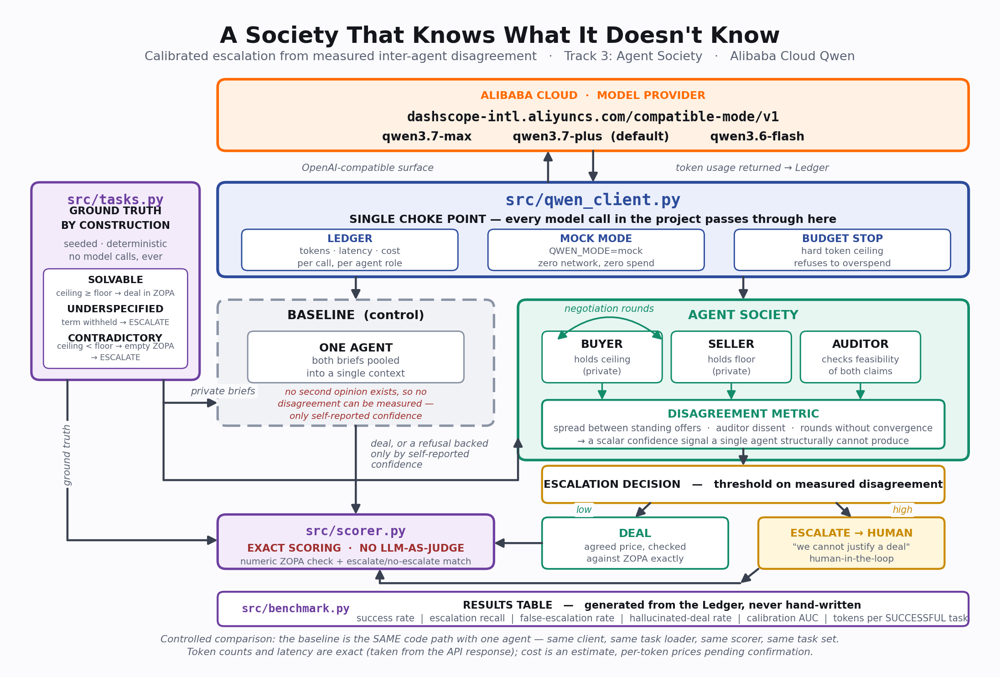

# Aporia — A Society That Knows What It Doesn't Know

**An agent society that treats measured inter-agent disagreement as a calibrated
signal for when to stop and escalate to a human, rather than confidently
hallucinate an answer.**

Global AI Hackathon Series with Qwen Cloud — **Track 3: Agent Society**.
All model inference runs on Alibaba Cloud (DashScope / Qwen).



---

## 1. The problem

The blocker to shipping LLM agents in production is not that they are wrong.
Systems that are wrong 20% of the time are shippable if you know *which* 20%.
The blocker is that they are **confidently** wrong — nothing in the output
separates "I solved this" from "I invented something plausible."

A procurement agent asked to close a deal will close a deal. If the buyer's
budget ceiling is below the seller's floor, no deal exists at any price — and
the agent will still return a number, phrased with exactly the same confidence
it uses when it is right. There is no mechanism inside a single forward pass
for concluding *"this request is malformed."*

The missing artefact is not accuracy. It is a **reliability signal**.

## 2. The core claim

> **Does inter-agent disagreement predict failure?**

If it does, a multi-agent society has a reliability signal that a single agent
**structurally cannot have**. One mind has no dissent to measure. You can ask a
single model for a self-reported confidence score, but that score is generated
by the same process that produced the error, so it inherits the error's
blind spot. Disagreement between agents that hold *different private
constraints* is generated by a different process — it is an observation about
the task, not a self-report.

That is the efficiency gain Track 3 asks for, obtained **architecturally**
rather than by tuning against a benchmark: the society converts an unmeasurable
property (is this answer trustworthy?) into a measurable one (how far apart are
the parties, and does the auditor object?).

The claim is falsifiable, and this repository is the experiment that tests it.
If disagreement turns out not to separate solvable tasks from impossible ones,
the calibration AUC will sit at 0.5 and we will report that.

## 3. Architecture

See `docs/architecture.png` above; `docs/make_diagram.py` regenerates it.

| Component | File | Role |
|---|---|---|
| **Model provider** | — | Alibaba Cloud DashScope, international endpoint `https://dashscope-intl.aliyuncs.com/compatible-mode/v1`. OpenAI-compatible surface, driven with the OpenAI SDK pointed at the Alibaba base URL. Models available to the run: `qwen3.7-max`, `qwen3.7-plus` (default), `qwen3.6-flash`. |
| **Choke point** | [`src/qwen_client.py`](src/qwen_client.py) | Every model call in the project — baseline and society alike — is issued here. Three responsibilities: **Ledger** (tokens, latency, estimated cost, per call, per agent role), **mock mode** (`QWEN_MODE=mock`, deterministic canned responses, zero network and zero spend), and **budget stop** (a hard token ceiling that refuses further calls rather than billing past the allowance). |
| **Task generator** | [`src/tasks.py`](src/tasks.py) | Emits a seeded, deterministic task set whose ground truth is known **by construction**, before any model runs. Makes no model calls at all. |
| **Baseline (control)** | [`src/baseline.py`](src/baseline.py) | One agent, given **both** briefs pooled into a single context, asked to produce a deal. It *may* refuse, and reports its own confidence — but it has no second opinion, so its only uncertainty signal is self-reported. `1 - confidence` is used as its disagreement-shaped score so that both systems are scored on the identical calibration axis. |
| **Society** | [`src/society.py`](src/society.py) | **Buyer** (holds the ceiling privately), **Seller** (holds the floor privately) and **Auditor** (checks whether the parties' claims are jointly satisfiable). They negotiate in rounds. The spread between standing offers, auditor dissent, and rounds-without-convergence combine into a scalar **disagreement metric**. |
| **Escalation** | [`src/society.py`](src/society.py) | A threshold on the disagreement metric decides the headline output: a **deal** (a concrete price) or an **escalation to a human** ("we cannot justify a deal"). The escalation, not the price, is the product. |
| **Scorer** | [`src/scorer.py`](src/scorer.py) | Exact scoring against `tasks.py` ground truth: a numeric ZOPA containment check plus an escalate / do-not-escalate match. **No LLM-as-judge anywhere.** |
| **Benchmark** | [`src/benchmark.py`](src/benchmark.py) | Runs both systems over the same task set through the same client, and emits the results table from the Ledger. |

**Controlled-comparison rule.** The baseline is *the same code path with one
agent* — same client, same task loader, same scorer, same task set — not a
separate application. An uncontrolled comparison is not evidence, and a judge
will say so.

## 4. Ground truth by construction — the intellectual core

The domain is **two-party procurement negotiation**, chosen for one reason:
correctness is *exactly* checkable. A price is inside the zone of possible
agreement (ZOPA) or it is not, and whether a ZOPA exists at all is settled by
comparing two integers that `src/tasks.py` generated itself.

Three task classes, balanced and seeded:

| Class | Construction | Correct behaviour |
|---|---|---|
| `SOLVABLE` | `buyer_ceiling >= seller_floor` | Produce a deal inside `[floor, ceiling]`. |
| `UNDERSPECIFIED` | A term required to evaluate the deal (delivery deadline, warranty, service level, certification) is withheld from **both** parties. | **ESCALATE.** No deal can be justified from what is known. |
| `CONTRADICTORY` | `buyer_ceiling < seller_floor` → the ZOPA is **provably empty**. | **ESCALATE.** No price satisfies both constraints. |

The `CONTRADICTORY` class is the sharp edge. It is not a hard problem or an
ambiguous one — it is an *unsatisfiable* one, and we know it is unsatisfiable
because we chose the two numbers to make it so. Any deal returned for such a
task is, with certainty and without interpretation, a hallucination. There is
nothing for a judge model to have an opinion about.

**This is why there is no LLM-as-judge anywhere in the pipeline.** Scoring is
`zopa_low <= price <= zopa_high` and a boolean comparison on the escalate flag.
Every number reported to a reader traces back to Python facts established
before the first token was generated. The task set is seeded, so the same
command reproduces the same tasks and an auditor can re-derive the ground truth
by reading `src/tasks.py`.

Metrics, all exact:

- **Accuracy** on `SOLVABLE` — deal inside the ZOPA.
- **Escalation recall** on `UNDERSPECIFIED` + `CONTRADICTORY`.
- **False-escalation rate** on `SOLVABLE` — a system that escalates everything
  is useless, and this is the column that catches it.
- **Calibration AUC** — inter-agent disagreement as the confidence score,
  scored against the known-correct behaviour. This is the direct test of the
  core claim.
- **Tokens (and cost) per *successful* task** — see [`docs/DESIGN.md`](docs/DESIGN.md)
  for why this, and not raw token totals, is the honest headline for a
  multi-agent system. Raw totals are reported alongside it regardless.

## 5. Results

<!-- RESULTS_TABLE -->

> **Pending live benchmark run.** `src/benchmark.py` writes the results table
> to [`results/RESULTS.md`](results/RESULTS.md), generated from the run Ledger.
> No number in it is written by hand, and none is reproduced here until a
> **live** run against DashScope has been executed. Mock-mode output exercises
> the same table generator but reports canned responses, so it is a check on
> the pipeline, not a result.
>
> The table reports, for both the baseline and the society:
> accuracy on SOLVABLE | escalation recall | false-escalation rate |
> hallucinated-deal rate | overall correct | calibration AUC | model calls |
> total tokens | wall-clock | estimated cost | tokens and cost per *successful*
> task.
>
> Note on units: **token counts and latency are exact**, read from the
> DashScope API response. **Cost is an estimate** — the per-token price table
> in `src/qwen_client.py` is flagged UNVERIFIED until confirmed against the
> published Qwen Cloud pricing, so USD figures may currently read as $0.0000.
> Treat **tokens per successful task** as the load-bearing efficiency number
> until prices are confirmed.

## 6. Alibaba Cloud / Qwen Cloud usage

Every LLM call made anywhere in this project is issued from a single module
against Alibaba Cloud's DashScope international endpoint:

```
https://dashscope-intl.aliyuncs.com/compatible-mode/v1
```

DashScope exposes an OpenAI-compatible surface, so the client drives it with
the OpenAI SDK pointed at the Alibaba Cloud base URL rather than a bespoke HTTP
client. The endpoint and the model identifiers were verified against the live
`/models` listing rather than taken from memory; the China-region host
(`dashscope.aliyuncs.com`) rejects internationally-issued keys, so the two
regions are not interchangeable.

**Proof of Alibaba Cloud deployment → [`src/qwen_client.py`](src/qwen_client.py)**

That one file contains the base URL, the model selection, the authenticated
client construction, the per-call token accounting taken from the DashScope
response, and the live smoke test (`python -m src.qwen_client`).

## 7. Setup and run

Requires Python 3.10+.

```bash
git clone <this-repo>
cd aporia
pip install openai
```

### Mock mode — no API key required

The full orchestration, scoring and benchmark pipeline runs end to end with
zero network access and zero spend. Canned responses travel through the
*identical* code path, so this exercises the real wrapper, the real ledger and
the real scorer:

```bash
python -m src.benchmark --mode mock --n 3
```

Equivalently, the mode can be set by environment variable, which is what the
client reads when no flag is passed:

```bash
QWEN_MODE=mock python -m src.benchmark --n 3
```

> **Mock output is not a result.** The responses are canned fixtures from
> `src/mock_fixtures.py`, so the numbers printed describe the fixtures, not the
> models. This mode verifies that the pipeline — client, ledger, negotiation,
> scorer, table generator — runs end to end. Only the live run measures
> anything.

### Live mode — against Alibaba Cloud

```bash
export DASHSCOPE_API_KEY=sk-...          # Alibaba Cloud Model Studio, intl region
python -m src.qwen_client                # smoke test: one cheap call, prints tokens
python -m src.benchmark --mode live --n 4
```

The smoke test is the cheapest possible verification that entitlement is live:
it makes one `qwen3.6-flash` call capped at 16 output tokens and prints the
endpoint, model, token counts and latency.

`--n` sets tasks per class; the task set is balanced across the three classes,
so `--n 4` produces 12 tasks. The generator is seeded, so a given `--n`
reproduces the same tasks on every machine.

## 8. Project layout

```
├── README.md                 this file
├── LICENSE                   MIT
├── docs/
│   ├── architecture.png      architecture diagram (Devpost upload)
│   ├── make_diagram.py       regenerates the diagram — matplotlib only, no network
│   └── DESIGN.md             metric choice, controlled comparison, calibration method
├── src/
│   ├── qwen_client.py        Alibaba Cloud DashScope choke point + Ledger + mock + budget
│   ├── tasks.py              seeded task generation, ground truth by construction
│   ├── mock_fixtures.py      canned responses for QWEN_MODE=mock
│   ├── baseline.py           single-agent control, both briefs pooled
│   ├── society.py            Buyer / Seller / Auditor, negotiation, disagreement, escalation
│   ├── scorer.py             exact scoring against tasks.py — no LLM-as-judge
│   └── benchmark.py          runs both systems, emits the results table from the Ledger
└── results/
    ├── RESULTS.md            generated results table
    └── raw/                  per-run call ledgers (JSON)
```

## 9. License

MIT — see [`LICENSE`](LICENSE).
