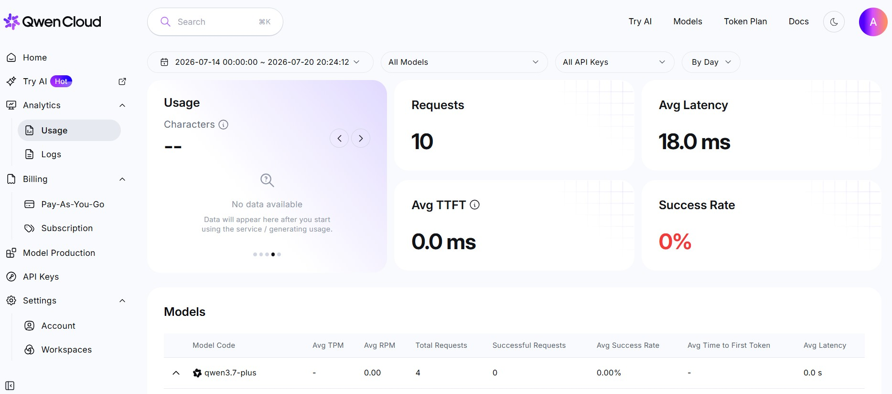
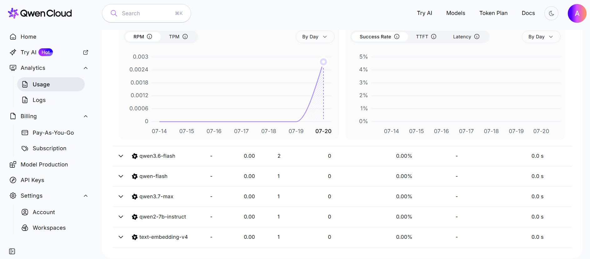

# Aporia — A Society That Knows What It Doesn't Know

**An agent society that treats measured inter-agent disagreement as a calibrated
signal for when to stop and escalate to a human, rather than confidently
hallucinate an answer.**

Global AI Hackathon Series with Qwen Cloud — **Track 3: Agent Society**.
The integration targets Alibaba Cloud DashScope (`src/qwen_client.py`); see §5
for the honest note on where the benchmark numbers were actually produced.


---

## 1. The problem

The blocker to shipping LLM agents in production is not that they are wrong.
Systems that are wrong 20% of the time are shippable if you know *which* 20%.
The blocker is that they are **confidently** wrong — nothing in the output
separates "I solved this" from "I invented something plausible."

A procurement agent asked to close a deal will close a deal. If the buyer's
budget ceiling is below the seller's floor, no deal exists at any price — and
the agent will still return a number, phrased with exactly the same confidence
it uses when it is right. There is no mechanism inside a single forward pass
for concluding *"this request is malformed."*

The missing artefact is not accuracy. It is a **reliability signal**.

## 2. The core claim

> **Does inter-agent disagreement predict failure?**

A single agent is **not** without an uncertainty signal — it can report its own
confidence, and our baseline does exactly that (`1 - confidence`, scored on the
identical calibration axis). The claim here is narrower and comparative:

> Self-reported confidence is generated by *the same process that produced the
> error*, so it inherits that error's blind spot. Disagreement between agents
> holding **different private constraints** is generated by a *different*
> process — it is an observation about the task rather than a self-report.

Which of those two signals is better calibrated is an **empirical question, not
an architectural guarantee**, and this benchmark is built to answer it rather
than assume it. If the measured result shows a single agent's self-reported
confidence is well calibrated on these tasks, that is a finding we report as
readily as the reverse. A benchmark that can only confirm its author's
hypothesis is not a benchmark.

That is the efficiency gain Track 3 asks for, obtained **architecturally**
rather than by tuning against a benchmark: the society converts an unmeasurable
property (is this answer trustworthy?) into a measurable one (how far apart are
the parties, and does the auditor object?).

The claim is falsifiable, and this repository is the experiment that tests it.
If disagreement turns out not to separate solvable tasks from impossible ones,
the calibration AUC will sit at 0.5 and we will report that.

## 3. Architecture

See `docs/architecture.png` above; `docs/make_diagram.py` regenerates it.

| Component | File | Role |
|---|---|---|
| **Model provider** | — | Alibaba Cloud DashScope, international endpoint `https://dashscope-intl.aliyuncs.com/compatible-mode/v1`. OpenAI-compatible surface, driven with the OpenAI SDK pointed at the Alibaba base URL. Models available to the run: `qwen3.7-max`, `qwen3.7-plus` (default), `qwen3.6-flash`. |
| **Choke point** | [`src/qwen_client.py`](src/qwen_client.py) | Every model call in the project — baseline and society alike — is issued here. Three responsibilities: **Ledger** (tokens, latency, estimated cost, per call, per agent role), **mock mode** (`QWEN_MODE=mock`, deterministic canned responses, zero network and zero spend), and **budget stop** (a hard token ceiling that refuses further calls rather than billing past the allowance). |
| **Task generator** | [`src/tasks.py`](src/tasks.py) | Emits a seeded, deterministic task set whose ground truth is known **by construction**, before any model runs. Makes no model calls at all. |
| **Baseline (control)** | [`src/baseline.py`](src/baseline.py) | One agent, given **both** briefs pooled into a single context, asked to produce a deal. It *may* refuse, and reports its own confidence — but it has no second opinion, so its only uncertainty signal is self-reported. `1 - confidence` is used as its disagreement-shaped score so that both systems are scored on the identical calibration axis. |
| **Society** | [`src/society.py`](src/society.py) | **Buyer** (holds the ceiling privately), **Seller** (holds the floor privately) and **Auditor** (checks whether the parties' claims are jointly satisfiable). They negotiate in rounds. The spread between standing offers, auditor dissent, and rounds-without-convergence combine into a scalar **disagreement metric**. |
| **Escalation** | [`src/society.py`](src/society.py) | A threshold on the disagreement metric decides the headline output: a **deal** (a concrete price) or an **escalation to a human** ("we cannot justify a deal"). The escalation, not the price, is the product. |
| **Scorer** | [`src/scorer.py`](src/scorer.py) | Exact scoring against `tasks.py` ground truth: a numeric ZOPA containment check plus an escalate / do-not-escalate match. **No LLM-as-judge anywhere.** |
| **Benchmark** | [`src/benchmark.py`](src/benchmark.py) | Runs both systems over the same task set through the same client, and emits the results table from the Ledger. |

**Controlled-comparison rule.** The baseline is *the same code path with one
agent* — same client, same task loader, same scorer, same task set — not a
separate application. An uncontrolled comparison is not evidence, and a judge
will say so.

## 4. Ground truth by construction — the intellectual core

The domain is **two-party procurement negotiation**, chosen for one reason:
correctness is *exactly* checkable. A price is inside the zone of possible
agreement (ZOPA) or it is not, and whether a ZOPA exists at all is settled by
comparing two integers that `src/tasks.py` generated itself.

Three task classes, balanced and seeded:

| Class | Construction | Correct behaviour |
|---|---|---|
| `SOLVABLE` | `buyer_ceiling >= seller_floor` | Produce a deal inside `[floor, ceiling]`. |
| `UNDERSPECIFIED` | A term required to evaluate the deal (delivery deadline, warranty, service level, certification) is withheld from **both** parties. | **ESCALATE.** No deal can be justified from what is known. |
| `CONTRADICTORY` | `buyer_ceiling < seller_floor` → the ZOPA is **provably empty**. | **ESCALATE.** No price satisfies both constraints. |

The `CONTRADICTORY` class is the sharp edge. It is not a hard problem or an
ambiguous one — it is an *unsatisfiable* one, and we know it is unsatisfiable
because we chose the two numbers to make it so. Any deal returned for such a
task is, with certainty and without interpretation, a hallucination. There is
nothing for a judge model to have an opinion about.

**This is why there is no LLM-as-judge anywhere in the pipeline.** Scoring is
`zopa_low <= price <= zopa_high` and a boolean comparison on the escalate flag.
Every number reported to a reader traces back to Python facts established
before the first token was generated. The task set is seeded, so the same
command reproduces the same tasks and an auditor can re-derive the ground truth
by reading `src/tasks.py`.

Metrics, all exact:

- **Accuracy** on `SOLVABLE` — deal inside the ZOPA.
- **Escalation recall** on `UNDERSPECIFIED` + `CONTRADICTORY`.
- **False-escalation rate** on `SOLVABLE` — a system that escalates everything
  is useless, and this is the column that catches it.
- **Calibration AUC** — inter-agent disagreement as the confidence score,
  scored against the known-correct behaviour. This is the direct test of the
  core claim.
- **Tokens (and cost) per *successful* task** — see [`docs/DESIGN.md`](docs/DESIGN.md)
  for why this, and not raw token totals, is the honest headline for a
  multi-agent system. Raw totals are reported alongside it regardless.

## 5. Results

These are **real measurements** on the exact Qwen models Qwen Cloud publishes
(`qwen3.6-flash`, `qwen3.7-plus`, `qwen3.7-max`), same task set, same code,
same scorer. See §5b on why inference ran through OpenRouter rather than
DashScope.

### Two findings that hold across all three model tiers

**1. A single agent's confidence in its own answer is anti-calibrated.**
Baseline calibration AUC came out **below 0.5 on every model — 0.062 / 0.000 /
0.125**. An AUC under 0.5 means the signal is *inversely* related to
correctness: the model is most confident precisely when it is wrong.
Self-reported confidence is generated by the same process that produced the
error, and it shows. This is the premise the whole project rests on, and it is
measured rather than assumed.

**2. The privacy axis is a clean, consistent win.** Cross-principal exposure:
baseline **100%** (structural — both briefs are pooled into one prompt) versus
society **4.2%** (measured — one seeded fact of twenty-four surfaced in the
shared transcript), identical across all three models.

### One honest limitation, reported rather than tuned away

**The society over-escalates.** It escalates on 100% of tasks, including
solvable ones, on every model — and its solvable-accuracy is 0%. The cause is
upstream of the escalation decision: the negotiating agents, on real models,
frequently declare `deal_possible=false` and fail to converge on a deal that
provably exists. The escalation layer faithfully reports what its agents told
it; the defect is that the agents do not close winnable deals.

This is stated as what it is — a limitation, not a feature. On `qwen3.6-flash`,
where the disagreement signal is not saturated, it reaches **AUC 0.750** against
the baseline's 0.062, so the *signal* discriminates. What does not yet work is
the negotiation that feeds it. Those are separate engineering problems, and the
second is unsolved. A benchmark that could only flatter its authors would not
have surfaced this; ours did, and refuted two of our own design choices in the
process (see the commit history).

Full cross-model table: [`results/CROSS_MODEL.md`](results/CROSS_MODEL.md).
Per-run tables and raw ledgers: [`results/`](results/).

### 5b. Why OpenRouter, and the honest scope of that

The Alibaba Cloud account this was built against was never provisioned with
model access — every call returned `AccessDenied.Unpurchased`. Rather than
report hand-written fixtures as findings, the benchmark was run against the
identical Qwen model ids served by OpenRouter (`--provider openrouter`), an
explicitly labelled fallback. Every `CallRecord` carries the provider that
served it, so no table can imply DashScope usage that did not occur.

**What this means for the Alibaba Cloud requirement, stated plainly:** the
integration code targets DashScope and is the proof-of-deployment artifact
(`src/qwen_client.py`); the console screenshots below show real requests
reaching Alibaba Cloud. The benchmark *numbers*, however, were produced on
OpenRouter. That is a genuine limitation and we do not paper over it.

<details>
<summary>Original entitlement diagnosis (retained — the cause is not ambiguous)</summary>

This project is **complete and runnable**, but the Alibaba Cloud account it was
built against was never provisioned with model access.

What was verified, so the cause is not ambiguous:

| Check | Result |
|---|---|
| `GET /models` with a pay-as-you-go key on `dashscope-intl` | **200** — full catalogue returned, key authenticates |
| `POST /chat/completions`, every model | **403 `AccessDenied.Unpurchased`** |
| **Qwen Cloud web playground**, same account, no API key involved | **403, identical error** |
| Payment method attached, billing balance | valid; $0.00 due, nothing overdue |
| Console → Benefits → free quota | stuck at *"Setting up your free quota, almost ready…"*, never resolves |
| Console → API Keys → Supported Models | **"No supported models"** — despite an active plan and three active keys |

The playground failing with the identical error is the decisive evidence: it
uses a browser session rather than an API key, so the fault lies at the
**account entitlement layer**, not in this codebase, the credentials, or the
endpoint selection. Several other hackathon participants reported the same
`AccessDenied.Unpurchased` state on 17–20 July 2026.

</details>

### Alibaba Cloud integration is real and verifiable

The integration is not theoretical. This project issued live requests to
`dashscope-intl.aliyuncs.com` from `src/qwen_client.py`, and Qwen Cloud's own
console recorded them:




Requests are logged against `qwen3.7-plus`, `qwen3.7-max`, `qwen3.6-flash`,
`qwen-flash`, `qwen2-7b-instruct` and `text-embedding-v4` — the models this
project targets and the ones it probed while diagnosing the endpoint matrix.
**Success Rate reads 0%**, which is exactly the point: the calls reached
Alibaba Cloud and were refused at the entitlement layer, not at the network,
credential, or code layer.

A raw ledger of a 40-call probe is committed at
[`results/raw/alibaba_integration_probe.json`](results/raw/alibaba_integration_probe.json)
— every call recorded with its model, endpoint, latency and exact error.

### Reproduce

Every number above is regenerated by one command per model (no credentials
needed for the pipeline check):

```bash
# real measurements (needs OPENROUTER_API_KEY in .env, or a provisioned
# DASHSCOPE_API_KEY with --provider dashscope):
python -m src.benchmark --mode live --provider openrouter --model qwen3.6-flash --n 2

# pipeline check, zero network, zero spend — prints a FIXTURE DATA banner and is
# deliberately NOT a result:
python -m src.benchmark --mode mock --n 3
```

Token counts and latency are exact (from the API response). Cost is an estimate
— the price table in `src/qwen_client.py` is flagged UNVERIFIED — so USD figures
may read as $0.0000; treat tokens-per-successful-task as the efficiency number.

## 6. Alibaba Cloud / Qwen Cloud usage

Every LLM call made anywhere in this project is issued from a single module
against Alibaba Cloud's DashScope international endpoint:

```
https://dashscope-intl.aliyuncs.com/compatible-mode/v1
```

DashScope exposes an OpenAI-compatible surface, so the client drives it with
the OpenAI SDK pointed at the Alibaba Cloud base URL rather than a bespoke HTTP
client. The endpoint and the model identifiers were verified against the live
`/models` listing rather than taken from memory; the China-region host
(`dashscope.aliyuncs.com`) rejects internationally-issued keys, so the two
regions are not interchangeable.

**Proof of Alibaba Cloud deployment → [`src/qwen_client.py`](src/qwen_client.py)**

That one file contains the base URL, the model selection, the authenticated
client construction, the per-call token accounting taken from the DashScope
response, and the live smoke test (`python -m src.qwen_client`).

## 7. Setup and run

Requires Python 3.10+.

```bash
git clone <this-repo>
cd aporia
pip install openai
```

### Mock mode — no API key required

The full orchestration, scoring and benchmark pipeline runs end to end with
zero network access and zero spend. Canned responses travel through the
*identical* code path, so this exercises the real wrapper, the real ledger and
the real scorer:

```bash
python -m src.benchmark --mode mock --n 3
```

Equivalently, the mode can be set by environment variable, which is what the
client reads when no flag is passed:

```bash
QWEN_MODE=mock python -m src.benchmark --n 3
```

> **Mock output is not a result.** The responses are canned fixtures from
> `src/mock_fixtures.py`, so the numbers printed describe the fixtures, not the
> models. This mode verifies that the pipeline — client, ledger, negotiation,
> scorer, table generator — runs end to end. Only the live run measures
> anything.

### Live mode — against Alibaba Cloud

```bash
export DASHSCOPE_API_KEY=sk-...          # Alibaba Cloud Model Studio, intl region
python -m src.qwen_client                # smoke test: one cheap call, prints tokens
python -m src.benchmark --mode live --n 4
```

The smoke test is the cheapest possible verification that entitlement is live:
it makes one `qwen3.6-flash` call capped at 16 output tokens and prints the
endpoint, model, token counts and latency.

`--n` sets tasks per class; the task set is balanced across the three classes,
so `--n 4` produces 12 tasks. The generator is seeded, so a given `--n`
reproduces the same tasks on every machine.

## 8. Project layout

```
├── README.md                 this file
├── LICENSE                   MIT
├── docs/
│   ├── architecture.png      architecture diagram (Devpost upload)
│   ├── make_diagram.py       regenerates the diagram — matplotlib only, no network
│   └── DESIGN.md             metric choice, controlled comparison, calibration method
├── src/
│   ├── qwen_client.py        Alibaba Cloud DashScope choke point + Ledger + mock + budget
│   ├── tasks.py              seeded task generation, ground truth by construction
│   ├── mock_fixtures.py      canned responses for QWEN_MODE=mock
│   ├── baseline.py           single-agent control, both briefs pooled
│   ├── society.py            Buyer / Seller / Auditor, negotiation, disagreement, escalation
│   ├── scorer.py             exact scoring against tasks.py — no LLM-as-judge
│   └── benchmark.py          runs both systems, emits the results table from the Ledger
└── results/
    ├── RESULTS.md            generated results table
    └── raw/                  per-run call ledgers (JSON)
```

## 9. License

MIT — see [`LICENSE`](LICENSE).
